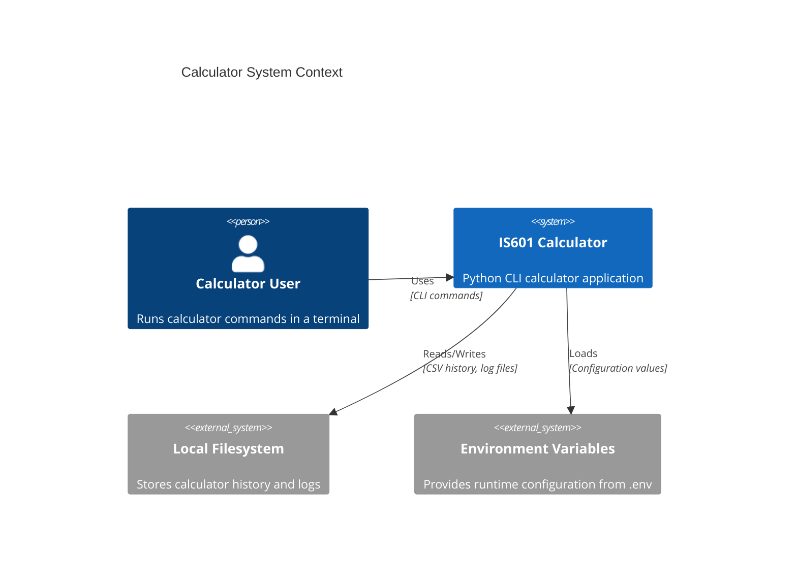
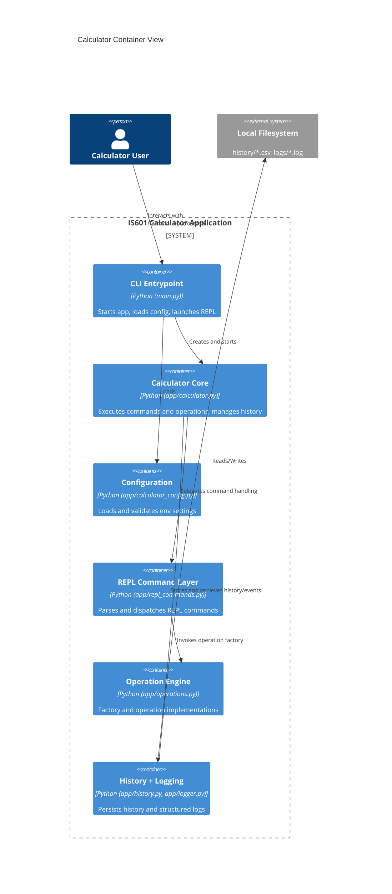
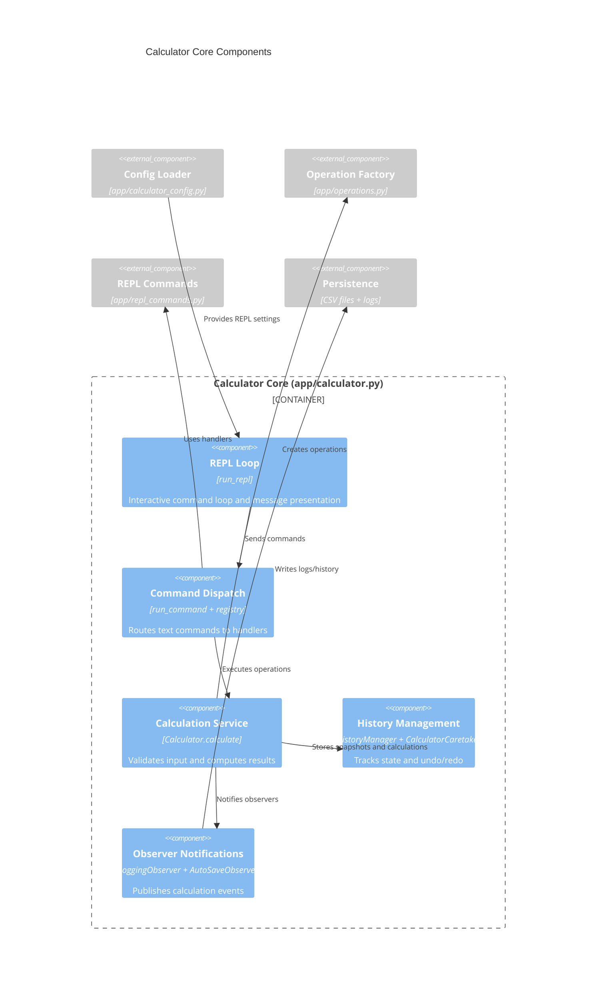
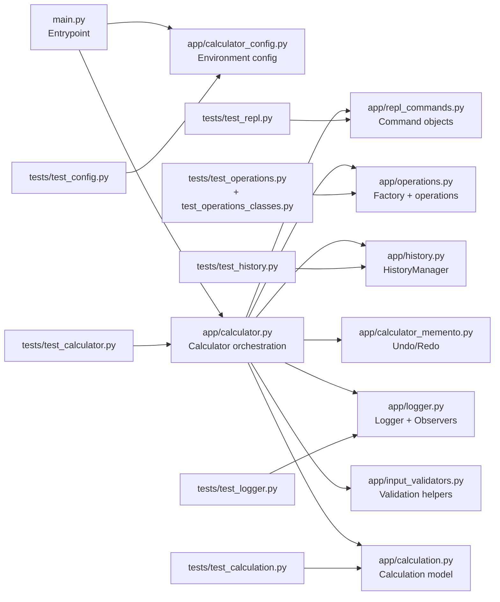
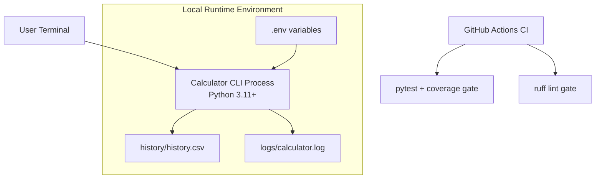

# C4 Architecture Diagrams

This document captures the calculator architecture using C4 model views.

> Important: use Markdown Preview for this file. Do not run Mermaid Preview on this `.md` file directly.

## Rendering Note

If you see an error like `Lexical error ... Unrecognized text. # C4 Architecture ...`, it means Mermaid Preview is parsing this whole Markdown file as Mermaid source.

Use one of the standalone Mermaid files in [docs/diagrams](docs/diagrams) for rendering/export:

- [docs/diagrams/c4-context.mmd](docs/diagrams/c4-context.mmd)
- [docs/diagrams/c4-container.mmd](docs/diagrams/c4-container.mmd)
- [docs/diagrams/c4-component-core.mmd](docs/diagrams/c4-component-core.mmd)
- [docs/diagrams/code-summary.mmd](docs/diagrams/code-summary.mmd)
- [docs/diagrams/deployment-view.mmd](docs/diagrams/deployment-view.mmd)

Quick steps in VS Code:

1. Open one `.mmd` file from the list above.
2. Run `Mermaid: Open Preview` (or right-click → Mermaid Preview).

## Level 1 — System Context

## Level 2 — Container Diagram

## Level 3 — Component Diagram (Calculator Core)

## Code Summary View

## Deployment View

